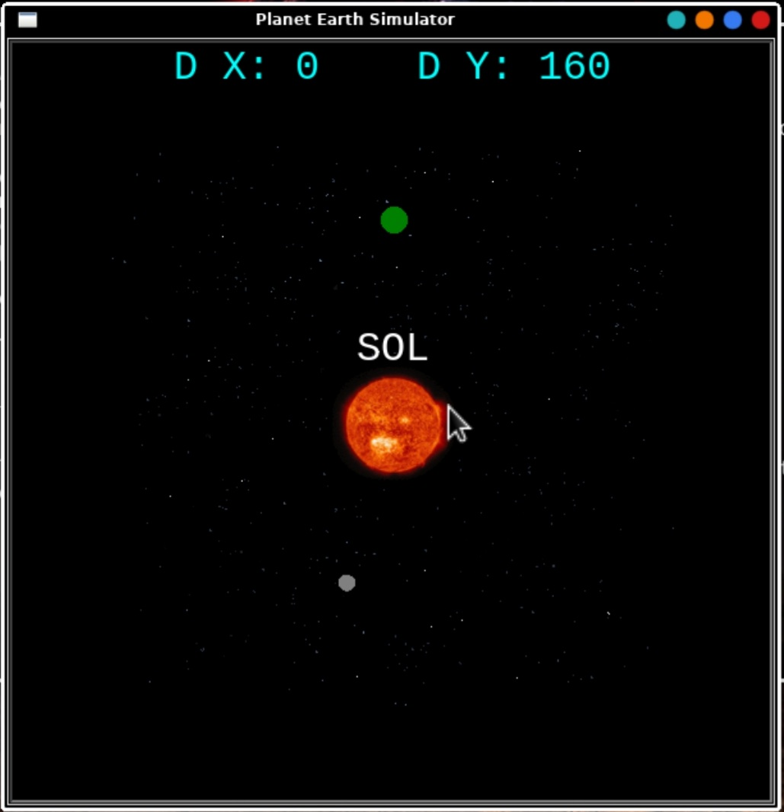

<p align="center">

</p>

Simulador de Planeta Tierra

REQUIERE:
======

* apt-get install python3
* apt-get install python3-tk
* Módulos requeridos `turtle`, `time`, `random`.
para la instalación use `pip3`
EJEMPLO:
`pip3 install turtle` 

DESCARGAR:
======

```
git clone https://github.com/Z3R07-RED/PlanetEarthS.git
```

USAR:
======

* `cd PlanetEarthS/`
* `chmod +x PlanetEarthS.py`
* `chmod +x requirements.txt`
* `pip3 install -r requirements.txt`
* `python3 PlanetEarthS.py`
